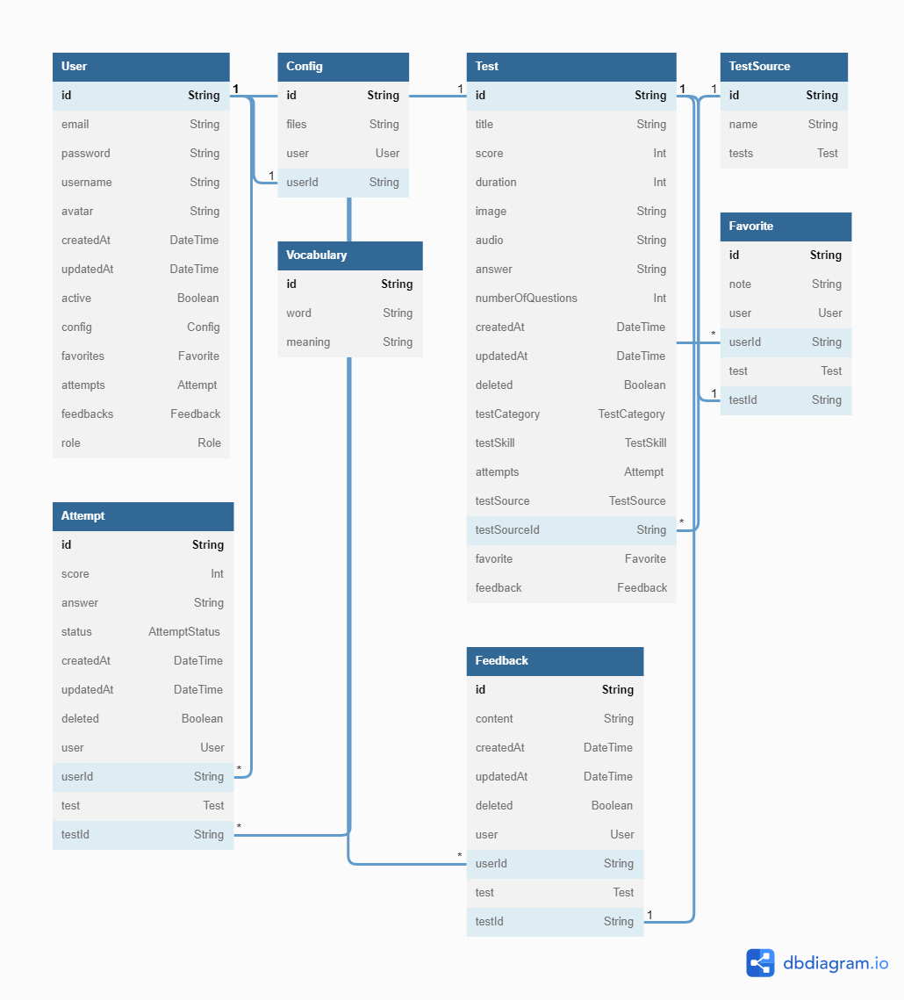

# TOEIC-PWA

A pwa that supports learning and practicing for the toeic exam

Tech stacks:

- fe: next + zustand + tailwind + antd
- be: nest + prisma
- db: mysql
- deploy: docker

Features:

- login/logout (lưu setting người dùng & thông tin)
- quản trị
  - thông tin tài khoản user
  - upload đề
  - quản lý feedback
  - quản lý đề
- thống kê
  - điểm trung bình
  - thời gian học
  - phổ điểm từng part
- lưu và quản lý vocab
- lưu đề yêu thích
- feedback đề
- chức năng giải đề

Extend features:

- tích hợp từ điển
- notification
- luợt hoàn thành bài + rating đề + điểm trung bình (public)
- suggest đề cho admin (hoặc upload tự do khi tích hợp AI)

Database design: 
Detail System design: ...
